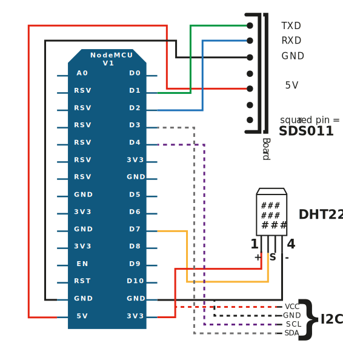
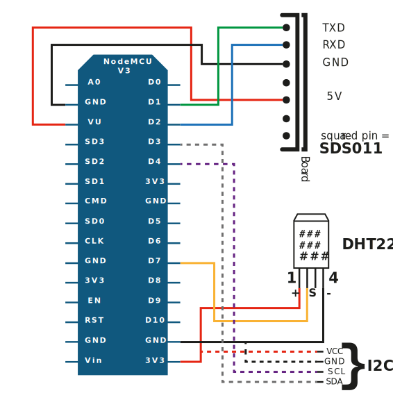
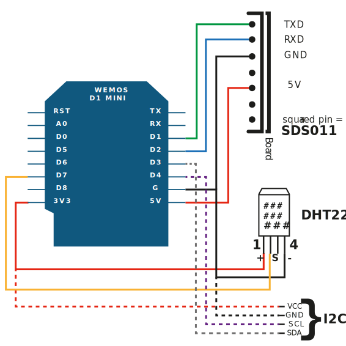

Som det nämns i Bygg guiden så finns det flera olika versioner av NodeMCU korten och även andra versioner som går att använda. Här följer information om hur du ser skillnad mellan dom och hur du monterar respektive variant.

| Generation        | Version           | “Vanligt” Namn  |
| ------------- |:-------------:| -----:|
| 1a      | 0,9 | V1 |
| 2a      | 1,0      |   V2 |
| 2a | 1,0      |    V3 |

Det som jag har skrivit som _Vanligt namn_ är vad de olika korten kallas på diverse inköpssidor. Den största skillnaden mellan V2 och V3
är att V3 tillverkas av flera olika aktörer som t.ex. Lolin och är en aning bredare än V2 korten.

## NodeMCU V1
Originalet men nu väldigt efter i utvecklingen och går knappt att hitta. Oftast med ett gult kretskort och måtten 47mm x 31mm.

Den har en ESP-12 modul och 4MB flashminne

| Utseende        | Kopplingsschema           |
| ------------- |:-------------:| 
|  |  |

## NodeMCU v2

| Utseende        | Kopplingsschema           |
| ------------- |:-------------:| 
|  |  |

## NodeMCU v3

| Utseende        | Kopplingsschema           |
| ------------- |:-------------:| 
|  |  |

## Wemos D1 mini

| Utseende        | Kopplingsschema           |
| ------------- |:-------------:| 
|  |  |
