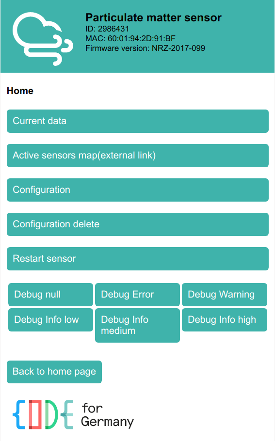
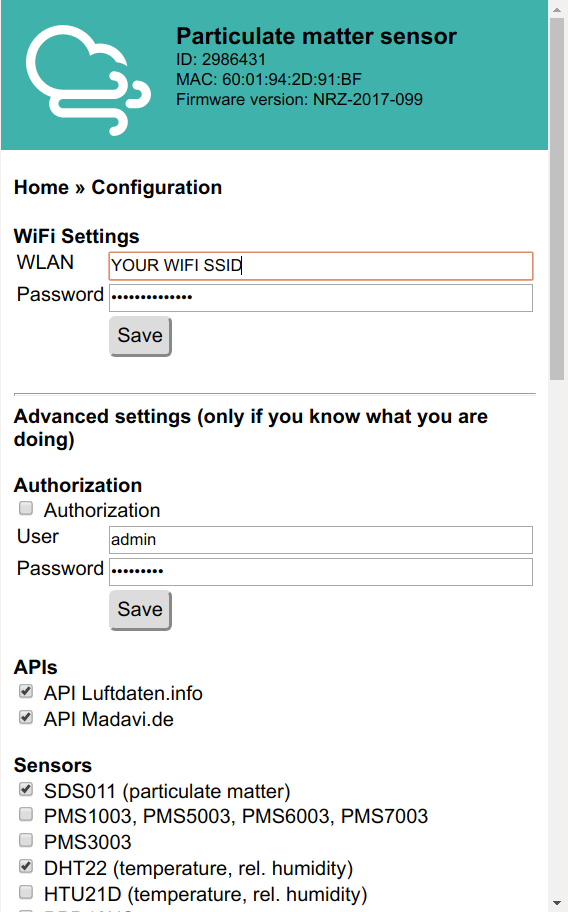

Efter du har anslutat mätstationen till USB-strömadaptern öppnar den en egen åtkomstpunkt med SSID `Feinstaubsensor-ID` där `ID` är lika med stationens (d.v.s. NodeMCU) ID. 

Koppla upp dig på åtkomstpunkten som är öppen och inte kräver något lösenord. Beroende på hur många andra trådlösa nätverk det finns i närheten så kan det krävas flera försök. Efter 10 minuter stängs åtkomstpunkten av med automatik.

Efter du har fått kontakt med mätstationens åtkomstpunkt kan du öppna adressen [http://192.168.4.1/](http://192.168.4.1) i din webbläsare för att komma åt din mätstations webbgränssnitt:

 | &nbsp;

Klicka på **Configuration** för att öppna (och ändra) inställningarna:

 | &nbsp;

Under **WiFi Settings** högst upp kan du mata in ditt nätverksnamn och lösenord. Förutom dessa inställningar behöver du inte ändra nånting om du har följt instruktionerna. Om du har kopplat in ytterligare sensorer eller displays så kan du behöva aktivera dessa längre ner i formuläret.

Så fort du har sparat inställningarna startas mätstationen om och är inte längre tillgänglig på ovan angivna IP-adressen, istället får den en IP-adress i ditt vanliga trådlösa nätverket. Du kan enkelt ta reda på din mätstations IP-adress med appen [Fling](https://www.fing.io/) som finns för Android och iOS. Om din router delar ut dynamiska IP-adresser är ett tips att ge mätstationen en fast IP-adress i din routers inställningar.

I fortsättningen försöker mätstationen koppla upp sig på det förinställda trådlösa nätverket. Om uppkopplingen misslyckas så öppnar den egen åtkomstpunkt i 10 minuter, precis som beskriven högst upp på denna sida.

  <h6>Ett första test!</h6>
  
Efter ca. 10 minuter kan du testa mätstationens rapportering på följande sidor (du behöver ersätta <code>2986431</code> med din sensorns ID):
  <ul>
  <li>PM2.5 och PM10: <a href="https://www.madavi.de/sensor/graph.php?sensor=esp8266-2986431-sds011" target="_blank"><code>https://www.madavi.de/sensor/graph.php?sensor=esp8266-2986431-sds011</code></a></li>
  <li>Temperatur & luftfuktighet: <a href="https://www.madavi.de/sensor/graph.php?sensor=esp8266-2986431-dht" target="_blank"><code>https://www.madavi.de/sensor/graph.php?sensor=esp8266-2986431-dht</code></a></li>
  <li>WLAN-signalstyrka: <a href="https://www.madavi.de/sensor/signal.php?sensor=esp8266-2986431" target="_blank"><code>https://www.madavi.de/sensor/signal.php?sensor=esp8266-2986431</code></a></li>
  </ul>
  

Nu är det bara att [medddela oss att din nya mätstation finns](../rapportera) för att den ska bli en del av det stora sensormolnet!


---
#### Nästa steg: [{{ page.pagination.next.name }}]({{ page.pagination.next.link }})
