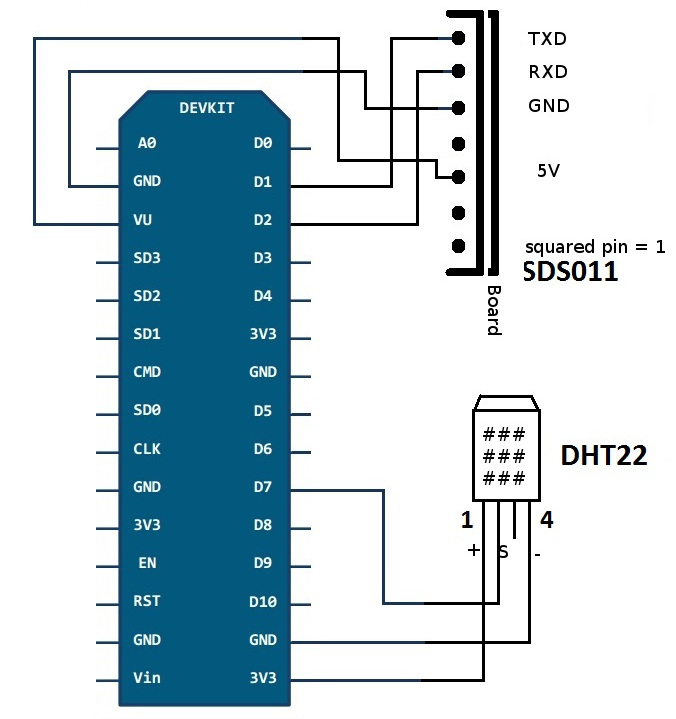

Du behöver [överföra firmware](../firmware) innan du kopplar ihop alla komponenter! Detta för att om det skulle vara så att firmware inte kan överföras så behöver du inte ta isär och sätta ihop allt igen. Det minskar också risken för att skada anslutningar när du kopplar in och ur USB-kabeln.

<div class="note">
  <h6>Andra versioner av NodeMCU än v3</h6>
  <p>Instruktionerna refererar till version 3 av NodeMCU. Detta kan identifieras med hjälp av anslutningarna VU och G (se kopplingsschema nedan). Hos andra versioner står RSV vid dessa anslutningar. På dessa kan VIN användas istället för VU och GND kan användas istället för G bredvid micro USB-porten.</p>
</div>

## Kopplingsschema NodeMCU v3 + SDS011 + DHT22



## Koppla SDS011 (partiklar)

Alla pins är numrerade från vänster till höger. Se till att kopplingskablarna verkligen sitter på rätt ställe, det är lätt hänt att de hamnar mellan eller bredvid pins.

```
SDS011 Pin 1 -> Pin D1 / GPIO5
SDS011 Pin 2 -> Pin D2 / GPIO4
SDS011 Pin 3 -> GND
SDS011 Pin 4 -> unused
SDS011 Pin 5 -> VU (NodeMCU v3) / VIN (NodeMCU v1,v2)
SDS011 Pin 6 -> unused
SDS011 Pin 7 -> unused
```

## Koppla DHT22 (temperatur och luftfuktighet)

Alla pins är numrerade från vänster till höger. "Gallret" är framsidan.

Vissa DHT22 har väldigt tunna pins som kan göra det svårt att få kopplingskablarna att sitta ordentligt. I sådana fall kan det hjälpa att vrida om kopplingskablarna 90 grader för att de ska få bättre fäste.

```
DHT22 Pin 1 -> Pin 3V3 (3.3V)
DHT22 Pin 2 -> Pin D7 (GPIO13)
DHT22 Pin 3 -> unused
DHT22 Pin 4 -> Pin GND
```

## Koppla in andra sensorer eller displays

Se ["Vanliga frågor"](/faq).