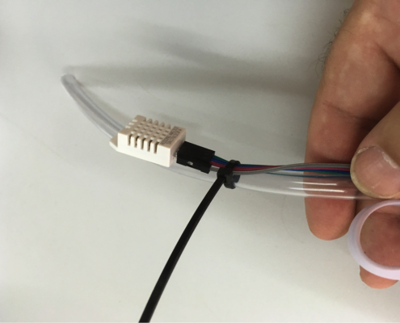
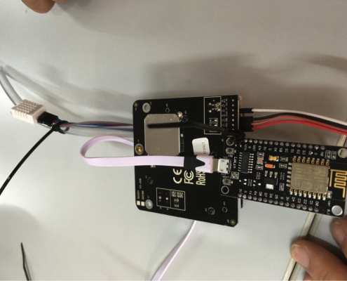
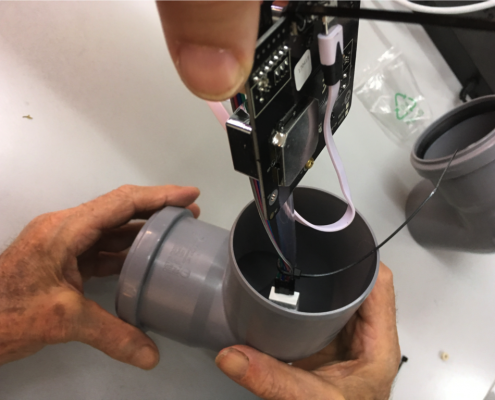
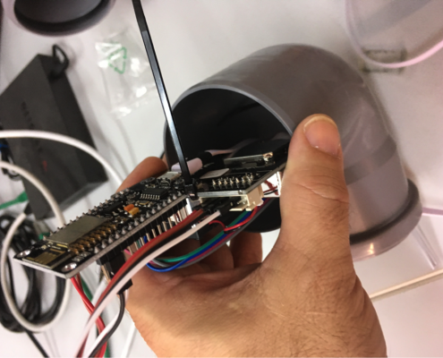
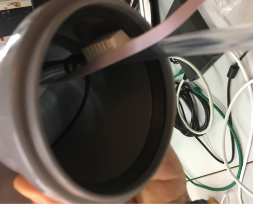

Nu ska vi fästa delarna i varandra och montera i väderskyddet.

Vi sätter ihop NodeMCU und partikelsensorn SDS011 med ett buntband så att WLAN-antennen pekar bort ifrån sensorn:

Vi tar ytterligare ett buntband och fäster temperatursensorn på slangen:

Vi drar USB-kabel genom en avloppsböj (börja på sidan utan tätning) och ser till att partikelsensorns fläkt är på undersidan. Skjut in delarna så att sensorn sitter fast i rörets böj, slangen och USB-kabeln ska sticka ut på andra sidan:

 | 

 | 

Nu är vi nästan klara. Vi tar en till avloppsböj och skjuter på den första (utan att klämma några kablar). Temperatursensorn positionerar vi så att den hamnar strax innanför rörändan. Om slangen sticker ut mycket kan den kortas ner, men den ska sticka ut nån centimeter.

Dra myggnät eller liknande över rörens öppna ändar så att insekter hindras från att komma in.


---
#### Nästa steg: [{{ page.pagination.next.name }}]({{ page.pagination.next.link }})
