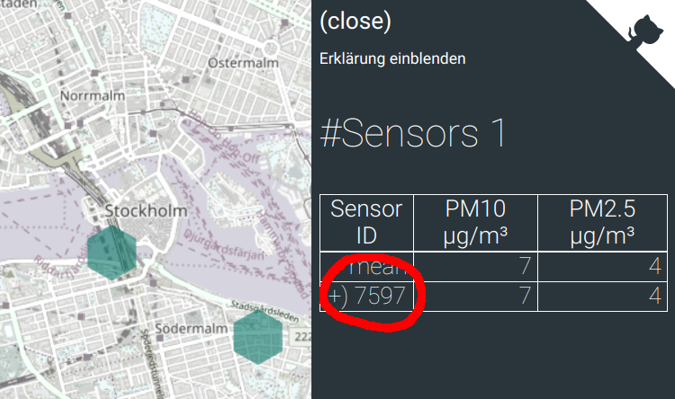

Det finns flera olika sätt att komma åt mätresultat som skickas till luftdaten.info och tillgängliggörs som öppna data. Denna sida sammanfattar åtkomst- och licensinformation.

## API

Det finns olika åtkomstpunkter, beroende på vilka data man vill komma åt. API:et levererar endast data som är aktuell nu, samt genomsnittsvärden för de senaste 5 minuter, den senaste timmen och de senaste 24 timmar.

Partikelsensorerna brukar ha två olika "value types" i svarsobjekten, value type `P1` är PM10 och value type `P2` är PM2.5. 

### Aktuell data (de senaste 5 minuter)

- Alla sensorer: `http://api.luftdaten.info/static/v1/data.json`
- En specifik sensor: `http://api.luftdaten.info/v1/sensor/{API-ID}/`
- Alla sensorer som matchar parametrarna: `http://api.luftdaten.info/v1/filter/{query}`
  - `type={sensor type}`: sensortyp, om flera typer ska matcha kan en kommaseparerad lista anges, t.ex. `type=SDS011,BME280`
  - `area={lat,lon,distance}`: alla sensorer inom en viss radie från en angiven position
  - `box={lat1,lon1,lat2,lon2}`: alla sensorer inom angiven "bounding box"
  - `country={landskod}`, alla sensorer i ett visst land, t.ex. `country=SE`
  
### Genomsnittsdata för olika tidsperioder
  
- Genomsnitt för de senaste 5 minuter per sensor
  - Alla sensorer: `http://api.luftdaten.info/static/v2/data.json`
  - Enbart luftpartiklar: `http://api.luftdaten.info/static/v2/data.dust.min.json`
  - Enbart temperatur, luftfuktighet och lufttryck: `http://api.luftdaten.info/static/v2/data.temp.min.json`
- Genomsnitt för den senaste timmen per sensor
  - Alla sensorer: `http://api.luftdaten.info/static/v2/data.1h.json`
- Genomsnitt för de senaste 24 timmar
  - Alla sensorer: `http://api.luftdaten.info/static/v2/data.24h.json`

## Arkiv

Utöver API:et med realtidsdata finns även ett arkiv med CSV-dumpar på [`http://archive.luftdaten.info`](http://archive.luftdaten.info/). Varje mapp motsvarar en dag och innehåller alla mätningar för samtliga sensorer. Filnamnen är uppbyggda enligt följande mönster: `YYYY-MM-DD_<sensor-typ>_sensor_<sensor-id>.csv`.

Du kan enkelt ta reda på en sensors ID-nummer genom att klicka på en sensor på kartan, "Sensor ID" visas sedan i informationsfliken till höger:

### Data från oregistrerade sensorer

Arkivet innehåller enbart data från registrerade sensorer, dvs. sensorer som är synliga på kartan. Om du vill komma åt inrapporterade data från icke registrerade sensorer så kan du försöka leta efter din NodeMCUs ID på [https://www.madavi.de/sensor/csvfiles.php](https://www.madavi.de/sensor/csvfiles.php). Observera att det inte finns nån garanti att dina data finns där (särskilt efter en längre tid), så denna sida är att betrakta som nödlösning om man inte har ordnat eget utrymme för att spara sina data.

## Licenser

Alla inrapporterade mätresultat är öppna data och kan även hittas genom öppna data-portaler som t.ex. [öppnadata.se](https://oppnadata.se).

Licensen för data är [Database Contents License (DbCL) v1.0](https://opendatacommons.org/licenses/dbcl/1-0/).

Licensen för mjukvaran [airrohr-firmware](https://github.com/opendata-stuttgart/sensors-software/tree/master/airrohr-firmware) är [GNU General Public License (GPL) v3](https://www.gnu.org/licenses/gpl-3.0.en.html).
